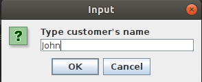
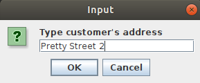
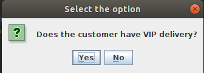
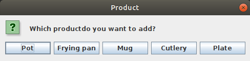
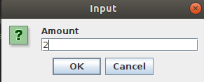
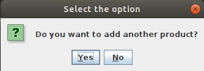
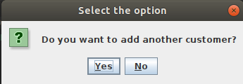
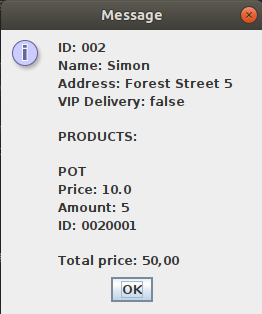
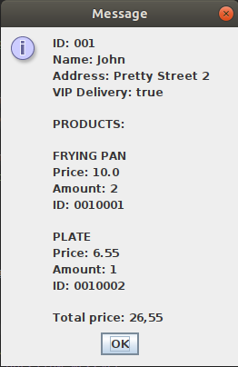

# Orders
Simple application made using Swing for creating customers' orders 

## Table of contents
* [General info](#general-info)
* [Screenshots](#screenshots)
* [Technologies](#technologies)
* [Features](#features)

## General info
Project made for the subject Human Computer Interaction on the Universitat de Valencia during my Erasmus+ exchange. The project was made to get familiar with Swing components.

## Screenshots
:-------------------------------------:|:-------------------------------------:
  |  
:-------------------------------------:|:-------------------------------------:
  |  
:-----------------------:|:---------------------------------------------------:
  |  
:-----------------------:|:---------------------------------------------------:
  |  
 

## Technologies
* Java - version 13.0.1
* Swing

## Features
* adding information about customers (name, address, VIP delivery)
* adding information about products (type, amount)
* calculation of the total cost of the order
* displaying all data

